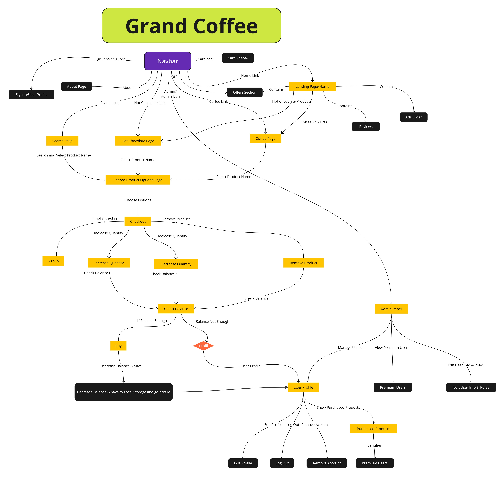
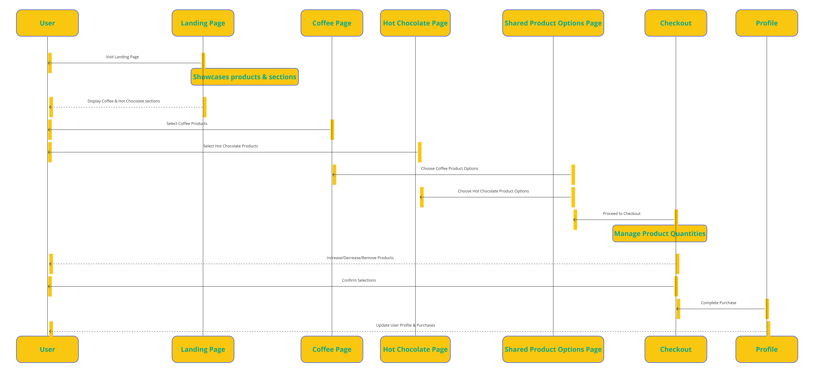
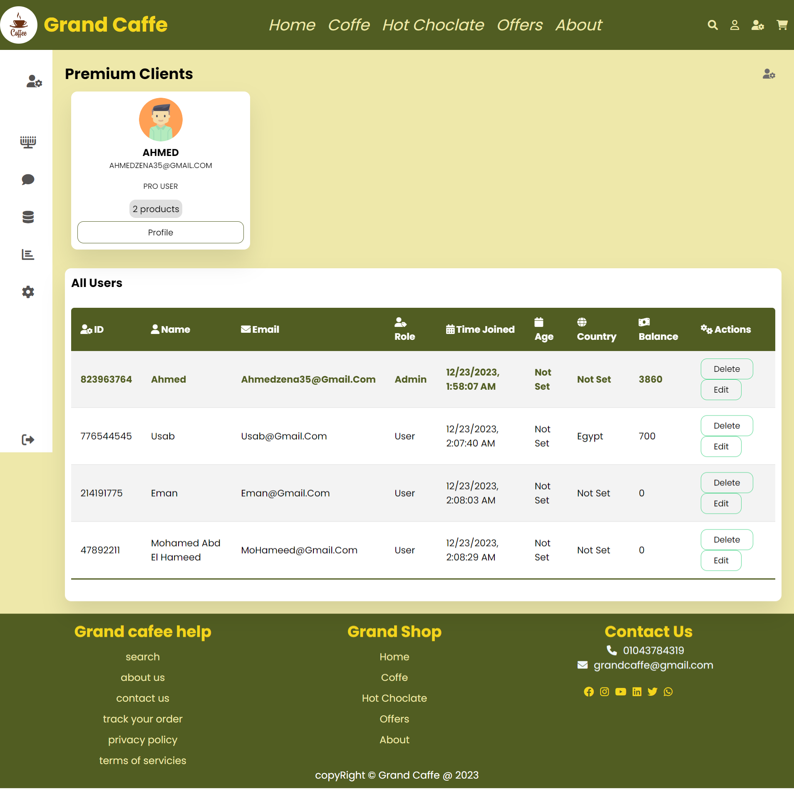

# Grand Caffe System

## Overview
This document outlines the features and functionalities of a comprehensive coffee shop system, including a detailed user interface for product browsing, checkout, and user profile management.

### Demo: [https://grand-caffe.vercel.app](https://grand-caffe.vercel.app/)

## Flow Chart of Grand Coffee

## Sequence diagram 
illustrating a simple guide for users on how to navigate and use your website:

### Key Features on the Home page 
- **Ads Slider:** Displays current promotions and ads.
- **Coffee Selections:** Dedicated sections for various coffee products, including 'Coffee to Go' and 'Hot Chocolate'.
- **Customer Reviews:** Section for displaying customer feedback.
- **About Us:** Provides information about the coffee shop and its services.

## User Experience

### Product Browsing
- **Selection:** Users can explore and select from a range of coffee products.
- **Details:** After selecting a product, users can choose specific sub-categories and sizes.

### Checkout Process
- **Sign-In:** Mandatory sign-in to access the checkout area.
- **Balance Verification:** The System checks the user's balance before finalizing the purchase.
- **Transaction Recording:** Purchase details are saved in local storage.

### User Profiles
- **Profile Details:** Includes user's name, email, age, and country.
- **Customization:** Users can change their name, age, country, balance, profile picture, and background image 
- **Management:** Functionalities for logging out and account deletion.

## Administration
- **User Oversight:** Admins can access and modify user profiles.
- **Premium User Tracking:** Admin capabilities include monitoring and managing premium users.

## Additional System Features
- **Team Information:** 'About Us' page with detailed team information.
- **Product Search:** Enables users to search for specific coffee products.
- **Contact us:** Enables users to send any messages to us.

## Tips for Developers

### Accessing the Admin Dashboard
To view the admin dashboard in the Grand Coffee System, you can manually set your user role to 'admin' in the local storage. Here's how:

1. Open the web application in your browser.
2. Use your browser's developer tools to access the local storage (usually found under the Application tab).
3. Modify the `role` key to the value `admin`.
4. Refresh the page, and you should see an admin icon in the navbar, allowing access to the admin dashboard.

This is intended for development and testing purposes only.

### The Dashboard

## Technical Aspects
### HTML
- Utilized for structuring the web pages of the system.

### CSS
- Applied for styling and visual design.

### JavaScript
- Handles interactive elements, user interactions, and local storage operations.

